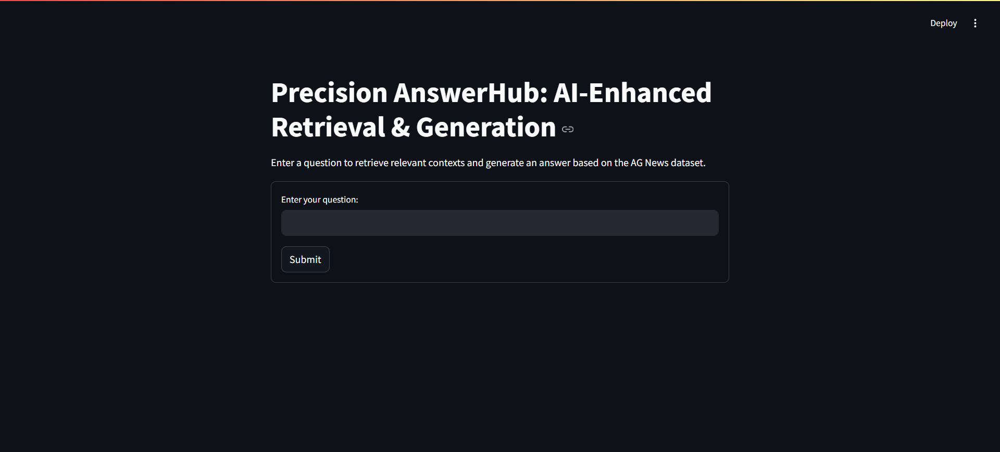
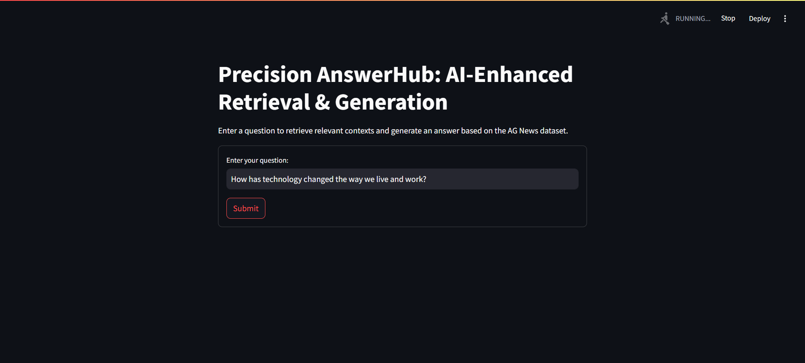
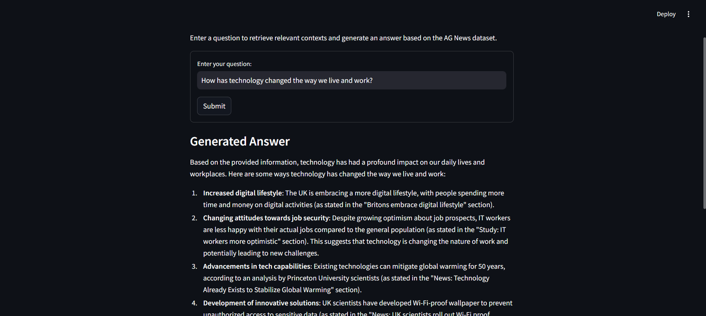

# Precision AnswerHub: AI-Enhanced Retrieval & Generation

This project implements a Retrieval-Augmented Generation (RAG) Q&A chatbot using FAISS for context retrieval and Ollama’s LLaMA model for response generation. The chatbot leverages the AG News dataset for context, providing relevant responses to user queries.


## Table of Contents
- [Overview](#overview)
- [Features](#features)
- [Setup and Installation](#setup-and-installation)
- [Downloading the Dataset](#downloading-the-dataset)
- [Running the Application](#running-the-application)
- [Project Structure](#project-structure)
- [Dependencies](#dependencies)
- [Usage](#usage)
- [License](#license)

## Overview
Precision AnswerHub uses FAISS (Facebook AI Similarity Search) to retrieve relevant contexts from the AG News dataset and a language model from Ollama to generate responses based on the retrieved contexts. The system is built using Streamlit for a user-friendly web interface.

## Features
- Contextual retrieval using FAISS
- Response generation using Ollama's LLaMA model
- Easy-to-use web interface with Streamlit
- Handles multiple topics and generates coherent responses based on the AG News dataset

## Setup and Installation

### 1. Clone the Repository
```bash
git clone https://github.com/yourusername/yourrepositoryname.git
cd yourrepositoryname
```

### 2. Set up a Virtual Environment
```bash
python -m venv venv
source venv/bin/activate  # On Windows, use `venv\Scripts\activate`
```

### 3. Install Requirements
Install the required dependencies using the `requirements.txt` file:
```bash
pip install -r requirements.txt
```

## Downloading the Dataset
The chatbot relies on the AG News dataset to retrieve context for queries.

1. Download the AG News dataset:
   - You can download it from the following URL: [AG News Dataset](https://www.kaggle.com/datasets/amananandrai/ag-news-classification-dataset).
   
2. Place the dataset file (`ag_news.csv` or similar) in the project root directory.

3. Convert it to a format compatible with the project (JSON format resembling SQuAD format) or modify the code to read the CSV directly.

### Preparing the Dataset
Run the `prepare.py` script to process the dataset and create embeddings:
```bash
python prepare.py
```

This script:
- Loads and processes the AG News data
- Generates embeddings for each question and context
- Creates a FAISS index for fast retrieval

## Running the Application

Once the embeddings and FAISS index are prepared, you can start the Streamlit app:

```bash
streamlit run app.py
```

### Sample Screenshots
Here’s what the interface looks like:

1. **Homepage with Query Input**  
   

2. **Submitting a Query**  
   

3. **Generated Answer**  
   

## Project Structure

```
.
├── app.py                  # Streamlit app interface
├── prepare.py              # Data processing and embedding preparation script
├── rag_pipeline.py         # Main pipeline for retrieval and generation
├── requirements.txt        # Project dependencies
├── local_dataset.json      # Preprocessed dataset in JSON format
├── question_embeddings.npy # Saved question embeddings
├── context_embeddings.npy  # Saved context embeddings
├── local_index.bin         # FAISS index
└── README.md               # Project documentation
```

## Dependencies

The following libraries are required for this project:
- `torch`: For deep learning model operations
- `transformers`: For tokenizer and model loading
- `sentence-transformers`: For sentence embeddings
- `faiss-cpu`: For efficient similarity search
- `streamlit`: For creating the web interface
- `ollama`: For interacting with the Ollama model API

All dependencies are included in the `requirements.txt` file.

## Usage
1. **Start the Ollama Server**  
   Ensure that the Ollama server is running and accessible. Refer to the [Ollama Documentation](https://ollama.com/docs) for setup instructions.

2. **Interact with the Chatbot**  
   - Enter your question in the text input field and click "Submit".
   - If relevant contexts are found, the chatbot will generate an answer.
   - If no contexts match, the app will inform you accordingly.
